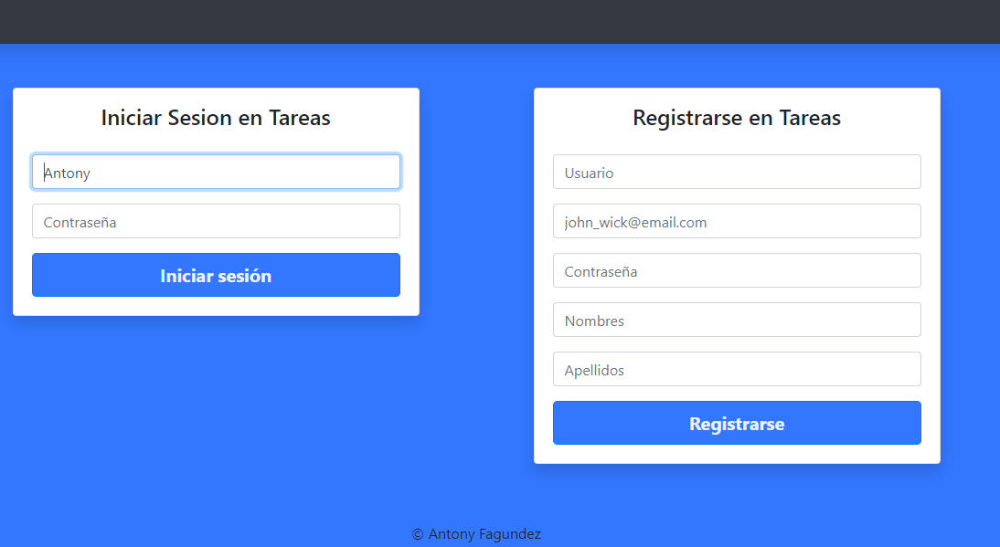
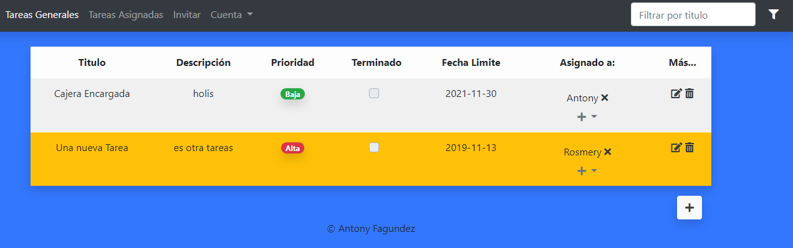
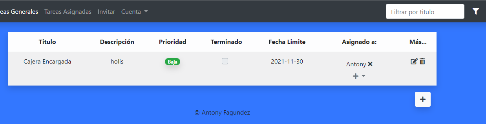
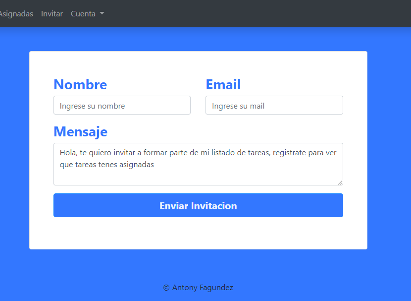
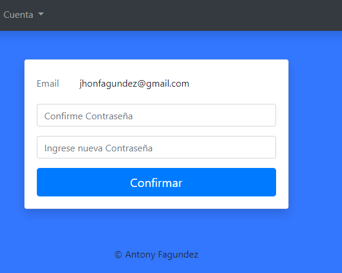
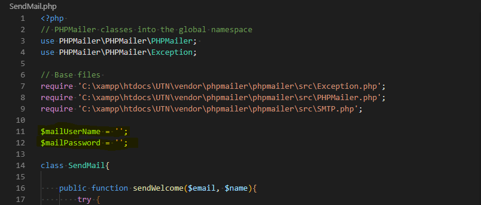

# ToDo App

## Alcance

Esta es una aplicacion, que posee, usuarios, usuarios asignados, y tareas que son compartidas en el main para todos y por todos, se prevee en una de los proximos features permitir una tabla por usuario o complejizarlo mas (como la aplicacion Trello).

-----

### **Login y Registro**

En la misma pagina, manejo de sesiones y carteles de notificacion cuando el registro se efectua correctamente.
Tambien se le envia confirmacion al usuario correctamente registrado.

----

### **Pagina principal**

Las tareas, se le pueden asignar usuarios que no estan en la aplicacion, se pretende en nuevo feature invitar automaticamente.

----

### **Tareas Asignadas**

Corresponden a las tareas del Usuario que esta logueado.

---

### **Invitar**

Formulario con invitacion a usuario.

---

### **Cuenta > Cambiar contraseña**

Pagina para cambiar contraseña que pide de nuevo la contraseña

----

# Configuraciones Necesarias

Instalar los paquetes necesarios con **composer**.
Cambiar el mail y el password de la clase **SendMail** por uno **válido**

